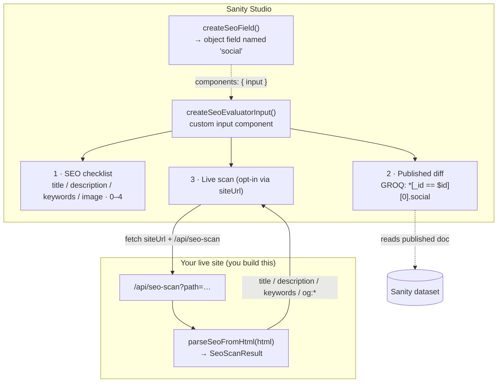

# sanity-typeface-seo

[](https://www.npmjs.com/package/@liiift-studio/sanity-typeface-seo)
[](https://github.com/Liiift-Studio/sanity-typeface-seo)
[](https://www.sanity.io)

Standalone Sanity SEO field definitions for typeface documents. Provides a shared social/SEO object, a visual SEO score evaluator, and optional marketplace link fields — reusable across any foundry studio.

**What you get:**

- A configurable **SEO/social schema field** (`title`, `keywords`, social `image`, `description`, plus optional canonical / noIndex / marketplace links).
- A **custom Studio input** that overlays the field editor with a live quality checklist, a draft-vs-published diff, and an optional live-site meta-tag scan.
- A framework-agnostic **`parseSeoFromHtml`** helper for building the scan endpoint the evaluator calls.

> **Heads up before you install:** the social image field is typed `cloudinary.asset`, so the [`sanity-plugin-cloudinary`](https://www.npmjs.com/package/sanity-plugin-cloudinary) plugin must be registered in your `sanity.config`, or the schema will fail to compile. See [Requirements](#requirements).

## How it works

The package ships schema fields and a Studio input. The "Live scan" panel is the only part that reaches outside the Studio — it `fetch`es a `/api/seo-scan` route **you** host on your live site, which uses the exported `parseSeoFromHtml` helper to return the rendered page's real meta tags for comparison against your draft.



## Install

```bash
npm install @liiift-studio/sanity-typeface-seo
```

## Usage

### Drop-in field

`seoField` is `createSeoField()` with defaults. It produces an object field **named `social`** (collapsible) — keep that name, because the evaluator's published-diff reads `social` from your dataset.

```typescript
import { defineType, defineField } from 'sanity'
import { seoField } from '@liiift-studio/sanity-typeface-seo'
// Or, with marketplace links (Adobe Fonts, Font Stand):
import { seoFieldWithLinks } from '@liiift-studio/sanity-typeface-seo'

export const typefaceSchema = defineType({
	name: 'typeface',
	type: 'document',
	fields: [
		defineField({ name: 'name', type: 'string' }),
		seoField, // adds an object field named 'social'
	],
})
```

### Custom field with `createSeoField`

`createSeoField(options)` returns a Sanity object field definition. Every option is off by default except `title`:

```typescript
import { createSeoField } from '@liiift-studio/sanity-typeface-seo'

const customSeoField = createSeoField({
	title: true,            // per-page title field (default: true)
	canonical: true,        // canonical URL override field (default: false)
	noIndex: true,          // "hide from search engines" toggle (default: false)
	marketplaceLinks: true, // Adobe Fonts + Font Stand link fields (default: false)
})
```

| Option | Default | Adds |
|---|---|---|
| `title` | `true` | Per-page `title` string field |
| `canonical` | `false` | `canonical` URL field |
| `noIndex` | `false` | `noIndex` boolean (emits `noindex, nofollow`) |
| `marketplaceLinks` | `false` | `adobeLink` + `fontStandLink` string fields |

The field always includes `keywords` (string), `image` (`cloudinary.asset`), and `description` (text).

### SEO evaluator component

`createSeoEvaluatorInput(options)` returns a Sanity `input` component. Attach it via `components.input` on the **same object field** — and keep the field named `social` so the published-diff query resolves:

```typescript
import { defineField } from 'sanity'
import { createSeoField, createSeoEvaluatorInput } from '@liiift-studio/sanity-typeface-seo'

const SeoEvaluatorInput = createSeoEvaluatorInput({
	siteUrl: 'https://dardenstudio.com',        // enables the Live scan tab
	urlFromSlug: (slug) => `/typefaces/${slug}`, // default shown
	slugPath: ['slug', 'current'],               // default shown
})

// Attach to the field produced by createSeoField (name stays 'social'):
const seoBlock = createSeoField({ canonical: true, noIndex: true })
export const seoFieldWithEvaluator = defineField({
	...seoBlock,
	components: { input: SeoEvaluatorInput },
})
```

`createSeoEvaluatorInput` accepts **only** `SeoEvaluatorOptions` (`siteUrl`, `urlFromSlug`, `slugPath`) — the schema flags (`canonical`, `noIndex`, `marketplaceLinks`) belong to `createSeoField`, not here. A ready-made no-scan instance is also exported as `SeoEvaluatorInput`.

**Evaluator panels:**

1. **SEO checklist** — scores title length (50–60 optimal), description length (150–160 optimal), keywords presence, and social image (0–4, with green / orange / red indicators).
2. **Published diff** — compares the current draft against the published Sanity document (reads `*[_id == $id][0].social`) before publishing.
3. **Live scan** *(opt-in)* — appears only when `siteUrl` is set; fetches your live page's rendered meta tags and diffs them against the draft. Requires the scan endpoint below.

<!-- TODO(maintainer): capture a screenshot of the evaluator in the running Studio (the three panels with the green/orange/red checklist) and drop it at assets/evaluator-panel.png. Studio UI can't be captured headlessly. Then uncomment:

-->

### Live scan endpoint (`parseSeoFromHtml`)

The Live scan panel calls `GET {siteUrl}/api/seo-scan?path=<page-path>` and expects a JSON `SeoScanResult`. Your site hosts that route; the package gives you `parseSeoFromHtml` to extract the tags from the fetched HTML. Example as a Next.js route handler:

```typescript
// app/api/seo-scan/route.ts (or pages/api/seo-scan.ts)
import { parseSeoFromHtml } from '@liiift-studio/sanity-typeface-seo'

export async function GET(req: Request) {
	const path = new URL(req.url).searchParams.get('path') ?? '/'
	const html = await fetch(new URL(path, req.url)).then((r) => r.text())
	return Response.json(parseSeoFromHtml(html))
}
```

`parseSeoFromHtml(html)` is pure and dependency-free (regex-based) — safe to call in any Node.js context. It returns:

```typescript
type SeoScanResult = {
	title: string | null
	description: string | null
	keywords: string | null
	ogTitle: string | null
	ogDescription: string | null
	ogImage: string | null
}
```

## API

| Export | Kind | Purpose |
|---|---|---|
| `seoField` | field | `createSeoField()` with defaults (object named `social`) |
| `seoFieldWithLinks` | field | `createSeoField({ marketplaceLinks: true })` |
| `createSeoField(options)` | factory | Build a configurable SEO object field |
| `SeoEvaluatorInput` | component | `createSeoEvaluatorInput()` with no live scan |
| `createSeoEvaluatorInput(options)` | factory | Build the evaluator input (enable scan via `siteUrl`) |
| `parseSeoFromHtml(html)` | function | Extract meta tags from HTML for the scan endpoint |
| `CreateSeoFieldOptions`, `SeoEvaluatorOptions`, `SeoValue`, `SeoScanResult` | types | Exported TypeScript types |

## Requirements

| Requirement | Notes |
|---|---|
| `sanity-plugin-cloudinary` | **Required** — the social `image` field is typed `cloudinary.asset`; register the plugin in `sanity.config` or the schema won't compile. |
| `/api/seo-scan` route on your site | Only needed for the Live scan panel; build it with `parseSeoFromHtml` (see above). |
| Field named `social` | The evaluator's published-diff GROQ reads `social`; keep the field name. |

### Peer Dependencies

| Package | Version |
|---|---|
| `@sanity/ui` | `>=2` |
| `react` | `>=18` |
| `sanity` | `>=3` |

## License

MIT © Liiift Studio. See the [repository](https://github.com/Liiift-Studio/sanity-typeface-seo).
